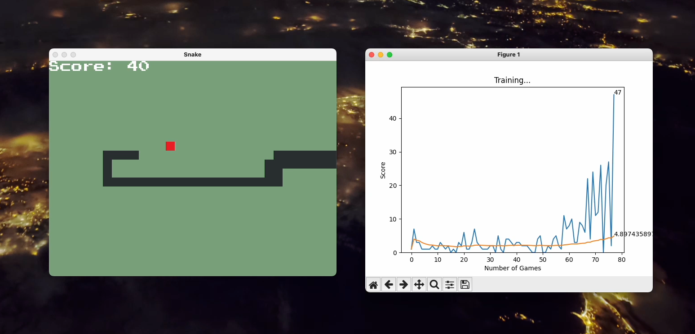

# SNAKE AI

Small project based on [this](https://youtu.be/L8ypSXwyBds?si=CKzTGcw2uGSbPqrk) tutorial. 
A project that contains a snake game written in PyGame and a neural network model (Pytorch) that 
is trained on playing this snake. 



### Setting up
```python
# python3.8
pip install -r requirements.txt
```

By default, the model is saved to the `model/model.pth`. It's possible to change it in `settings.py`

### Launching
```python
python agent.py
```
